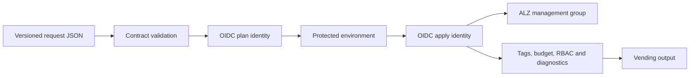

# Architecture

## Consumer journey

1. A workload owner copies the sample JSON request and supplies ownership, cost,
   classification, destination, connectivity, budget, expiry, and access data.
2. Contract validation rejects incomplete, over-privileged, or incompatible
   requests before Terraform reads them.
3. The plan identity produces a non-mutating plan against per-subscription state.
4. A protected GitHub environment gates the separate apply identity.
5. Vending moves the existing subscription, applies mandatory tags and budget,
   grants baseline access, connects Activity Logs to central operations, and
   returns a machine-readable subscription profile.



## Platform hierarchy

The pinned Azure Verified Module consumes Microsoft's pinned `platform/alz`
library and creates the standard hierarchy:

```text
Tenant root or existing organization parent
└── alz
    ├── platform
    │   ├── connectivity
    │   ├── identity
    │   ├── management
    │   └── security
    ├── landingzones
    │   ├── corp
    │   ├── online
    │   └── local
    ├── sandbox
    └── decommissioned
```

The tenant root remains minimally used. Real organizations should set
`parent_management_group_id` to an existing organization-specific intermediate
root. Platform subscription IDs are inputs so the lab does not attempt to buy
or create subscriptions.

## Boundaries

- This repository owns ALZ hierarchy/policy and workload subscription profiles.
- A dedicated network platform owns hub/VWAN implementation and fulfills the
  emitted `corp`, `online`, or `isolated` network contract.
- The central operations team owns the supplied Log Analytics workspace.
- Subscription creation is billing-system specific. The factory safely enrolls
  an existing subscription ID; an Enterprise Agreement or MCA alias adapter can
  be added before the profile module.
- PIM eligibility is designed outside Terraform; permanent privileged roles are
  explicitly rejected by the request contract.

## State and identity

Platform and each vended subscription use separate state keys, reducing blast
radius and contention. Azure Blob leases provide locking; versioning and
retention support recovery. GitHub receives short-lived federated tokens.
Plan and apply use different client IDs, and apply runs only after protected
environment approval.

## Cost controls

The ALZ hierarchy and policies do not incur direct consumption charges. Log
Analytics ingestion and connected networking do. Every workload receives a
monthly budget and expiration metadata. The repository does not deploy Azure
Firewall, VPN Gateway, Bastion, ExpressRoute, or a hub network.
