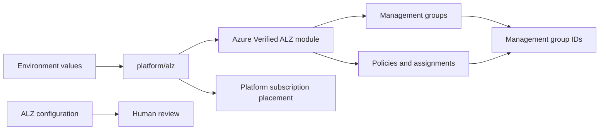
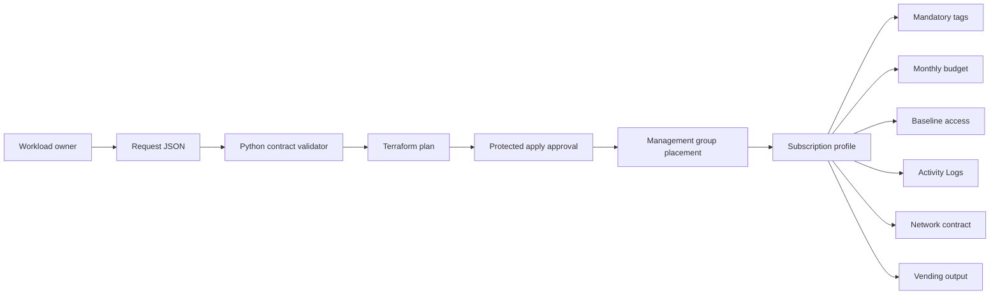
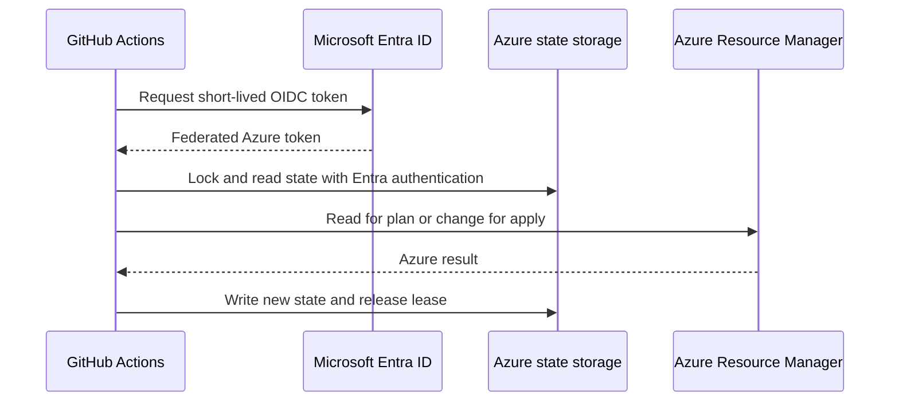
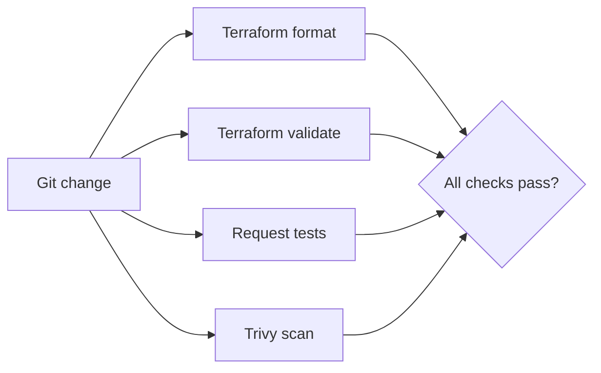

# Repository Guide

This document explains the Azure Landing Zone Factory in simple terms. It shows
what each folder contains, how the parts work together, how to run the project,
and how data moves through the system.

## 1. What this repository does

This repository has two main jobs:

1. **Build the Azure platform foundation.** It creates the standard Azure
   Landing Zone management group hierarchy and applies Microsoft's baseline
   policies.
2. **Onboard an existing Azure subscription.** A team submits a small JSON
   request. The factory moves that subscription to the correct management group
   and applies tags, a budget, access, diagnostics, and a networking profile.

The repository does not create application resources such as web apps,
databases, or virtual machines. Application teams deploy those resources after
the subscription has been onboarded.

## 2. Important terms

- **Landing zone:** A governed Azure environment where a workload can run.
- **Management group:** A container above subscriptions. Policies and access
  assigned to a management group are inherited by subscriptions below it.
- **Platform subscription:** A subscription used for shared services such as
  networking, identity, security, or monitoring.
- **Workload subscription:** A subscription used by one application or product.
- **Vending:** The repeatable process of preparing a workload subscription.
- **Terraform state:** Terraform's record of the Azure resources it manages.
- **OIDC:** A way for GitHub Actions to sign in to Azure with a short-lived token
  instead of a stored client secret.

## 3. Repository map

```text
azure-landing-zone-factory/
├── .github/                    GitHub review rules and automation
├── bootstrap/state/            Creates secure Terraform state storage
├── config/                     Human-readable platform and request data
├── docs/                       Architecture, decisions, guides, and runbooks
├── environments/               Example values for each deployment environment
├── modules/                    Reusable Terraform building blocks
├── platform/alz/               Deploys the Azure Landing Zone foundation
├── platform/vending/           Onboards one workload subscription
├── scripts/                    Request validation tools
├── tests/                      Automated contract tests
├── README.md                   Short project introduction and quick start
├── SECURITY.md                 Security rules and reporting process
├── CONTRIBUTING.md             Contribution expectations
├── CHANGELOG.md                User-visible change history
├── Makefile                    Short commands for local validation
└── .gitignore                  Prevents state, plans, and local values from Git
```

Generated `.terraform/` folders are local download caches. They are ignored by
Git and are not part of the repository design.

## 4. Folder-by-folder explanation

### `.github/`

This folder controls how changes are reviewed and deployed in GitHub.

- `CODEOWNERS` identifies the reviewer for sensitive platform, workflow, policy,
  and access code.
- `PULL_REQUEST_TEMPLATE.md` asks contributors to describe risk, cost, policy,
  access, and test evidence.
- `ISSUE_TEMPLATE/config.yml` directs security reports away from public issues.
- `workflows/validate.yml` checks Terraform formatting and validity, runs the
  request tests, and scans infrastructure code for security problems.
- `workflows/plan-platform.yml` creates a platform plan with the read-only plan
  identity.
- `workflows/deploy-platform.yml` creates and applies a platform plan after the
  protected apply environment is approved.
- `workflows/plan-vending.yml` validates a selected request and plans the
  subscription onboarding.
- `workflows/deploy-vending.yml` validates the request again and applies it after
  approval.

The plan and apply workflows use different Azure client IDs. This limits what a
planning identity can change and gives the deployment identity a separate
approval boundary.

### `bootstrap/state/`

Terraform needs state storage before it can manage the rest of the platform.
This folder solves that setup problem.

- `main.tf` creates a resource group, storage account, and private blob
  container. It enables versioning and deletion retention.
- `variables.tf` accepts the Azure subscription, region, naming prefix,
  redundancy level, and trusted IP ranges or subnets.
- `outputs.tf` returns the non-secret backend values needed by the other roots.
- `versions.tf` pins Terraform and provider requirements.
- `.terraform.lock.hcl` records the exact tested provider versions.

The storage firewall uses `Deny` by default. A trusted runner network must be
provided before GitHub Actions or a workstation can use this backend.

### `config/alz/`

This folder describes platform intent in a form that is easy to review.

- `architecture.yaml` shows the expected management group hierarchy and pins
  the ALZ module and library versions.
- `policy-defaults.yaml` records expected locations, mandatory tags, diagnostic
  behavior, and the audit-first policy rollout rule.

These files are review contracts and documentation. The Microsoft ALZ library
used by `platform/alz/` contains the deployable baseline policy definitions and
assignments.

### `config/platform-subscriptions/`

- `lab.tfvars.example` shows how existing connectivity, identity, management,
  and security subscriptions are mapped to platform management groups.

The IDs are placeholders. Copy the example to a local `.tfvars` file and replace
them. Local `.tfvars` files are ignored to avoid publishing tenant inventory.

### `config/vending-requests/`

This is the starting point for workload teams.

- `schema.json` is the formal shape of a request.
- `sample-sandbox.json` is a safe example that can be copied.

A request contains:

- application name and accountable owner;
- cost center and monthly budget;
- environment and data classification;
- existing subscription ID;
- target management group;
- network profile;
- expiration date;
- central Log Analytics workspace;
- optional role assignments and extra tags.

The request is versioned in Git so the reason for a subscription change can be
reviewed and audited.

### `environments/`

- `lab/platform.tfvars.example` supplies example values to the platform root.

An organization can add other folders such as `development` or `production`.
Each environment should use a different backend state key and protected GitHub
environment. Do not copy module code between environments.

### `platform/alz/`

This is the platform Terraform root.

- `versions.tf` configures the Azure ALZ and AzAPI providers and the remote
  Azure Storage backend.
- `variables.tf` defines location, parent management group, platform
  subscriptions, optional workload placements, hierarchy settings, and
  telemetry.
- `main.tf` calls the pinned Azure Verified ALZ module. It passes the parent
  scope and places existing platform subscriptions.
- `outputs.tf` returns the created management group and policy assignment IDs.
- `.terraform.lock.hcl` locks tested providers.

It builds this hierarchy:

```text
Tenant root or existing organization parent
└── alz
    ├── platform
    │   ├── connectivity
    │   ├── identity
    │   ├── management
    │   └── security
    ├── landingzones
    │   ├── corp
    │   ├── online
    │   └── local
    ├── sandbox
    └── decommissioned
```

`corp` is intended for workloads that use corporate connectivity. `online` is
for independently connected or internet-facing workloads. `sandbox` is for
experimentation. `decommissioned` isolates subscriptions being retired.

### `platform/vending/`

This is the workload onboarding Terraform root.

- `versions.tf` loads the request JSON and configures Azure providers for the
  requested subscription.
- `variables.tf` accepts the path to one request file.
- `main.tf` checks the request, moves the subscription to the selected
  management group, and calls the subscription profile module.
- `outputs.tf` returns a useful onboarding result for the workload owner.
- `.terraform.lock.hcl` locks tested providers.

Each subscription uses its own state key:

```text
vending/<subscription-id>.tfstate
```

This separation prevents one workload's state from controlling another
workload.

### `modules/budget/`

Creates a monthly Azure subscription budget. It sends alerts at 80% and 100% to
the request's contact email addresses.

### `modules/diagnostics/`

Sends Azure subscription Activity Logs to the central Log Analytics workspace.
The captured categories include security, policy, health, administration, and
service alerts.

### `modules/role-assignments/`

Creates the approved subscription-level access entries from the request.
Privileged roles such as Owner and User Access Administrator are rejected.
Group assignments are preferred over direct user assignments.

### `modules/workload-network-profile/`

Records the network contract selected by the workload:

- `isolated` means no platform network attachment;
- `corp` means the network platform must attach corporate connectivity;
- `online` means the network platform must attach online connectivity.

This repository does not build the hub network. A separate network platform can
consume this contract and complete the connection.

### `modules/subscription-profile/`

This is the main composition module for a workload. It:

1. applies mandatory subscription tags;
2. calls the budget module;
3. calls the role assignment module;
4. calls the diagnostics module;
5. calls the network profile module;
6. returns one combined result.

Mandatory tags override extra tags with the same name. This prevents a request
from changing governed values such as Owner, CostCenter, or ExpirationDate.

### `scripts/`

- `validate-request.py` validates requests without third-party Python packages.

It checks required and unknown fields, UUIDs, email addresses, dates, allowed
values, budget size, role safety, and network/destination compatibility. It
rejects restricted data in a sandbox.

### `tests/`

- `contract/test_vending_request.py` proves that the sample passes and invalid
  requests fail for the expected reasons.

The current tests cover a missing owner, privileged role, restricted sandbox
data, and a mismatched network profile.

### `docs/`

- `architecture/overview.md` explains the design and ownership boundaries.
- `decisions/0001-use-avm-alz.md` records why the Microsoft ALZ module is used.
- `runbooks/operations.md` covers failures, moves, rollback, state recovery,
  exemptions, and decommissioning.
- `repository-guide.md` is this step-by-step guide.

### Root files

- `README.md` is the five-minute project introduction.
- `readme` redirects readers from the original lowercase file.
- `Makefile` provides `make fmt`, `make test`, `make validate`, and `make check`.
- `.pre-commit-config.yaml` runs formatting, validation, JSON/YAML checks, and
  private-key detection before a commit.
- `.editorconfig` keeps text formatting consistent.
- `.gitignore` blocks local Terraform state, plan files, `.tfvars`, credentials,
  editor files, and Python cache files.
- `SECURITY.md`, `CONTRIBUTING.md`, `CHANGELOG.md`, and `LICENSE` provide the
  normal operating information for a public repository.

## 5. Data flow

There are four connected data flows.

### A. Platform deployment flow



Step by step:

1. The platform team supplies a location, parent management group, and existing
   platform subscription IDs.
2. Terraform passes those values to the pinned Azure Verified ALZ module.
3. The module reads the pinned Microsoft ALZ library.
4. Azure receives management group, policy, and subscription placement changes.
5. Terraform records the Azure resource IDs in platform state and outputs.

### B. Workload vending flow



Step by step:

1. A workload owner copies the sample request and fills in real values.
2. The Python validator rejects the request if required information is missing
   or unsafe.
3. Terraform reads the same JSON file. There is no second copy of the request
   data to become inconsistent.
4. The plan shows the management group move and all profile changes.
5. An authorized reviewer approves the apply environment.
6. Terraform moves the subscription and applies the profile modules.
7. Azure sends future Activity Logs to the specified central workspace.
8. Terraform stores the result in that subscription's state file and returns a
   combined output.

### C. State and identity flow



No Azure client secret is stored in GitHub. The state account uses Entra
authentication, network restrictions, blob leases, versioning, and retention.

### D. Pull request validation flow



Validation does not deploy Azure resources. Deployment happens only through a
separately selected plan or apply workflow.

## 6. How to use the repository

### Step 1: Install local tools

Install:

- Terraform 1.12 or newer;
- Azure CLI;
- Python 3;
- Git.

Sign in only for local lab work:

```bash
az login
az account set --subscription "<bootstrap-or-management-subscription-id>"
```

GitHub Actions should use OIDC rather than `az login` or a stored secret.

### Step 2: Run local checks

```bash
make test
```

This validates the sample request and runs contract tests.

To initialize providers and validate all deployment roots:

```bash
make validate
```

To run all local checks:

```bash
make check
```

### Step 3: Create state storage

Choose trusted runner CIDRs or subnet IDs. Then run:

```bash
terraform -chdir=bootstrap/state init
terraform -chdir=bootstrap/state plan \
  -var="subscription_id=<state-subscription-id>" \
  -var='allowed_ip_rules=["203.0.113.10"]'
terraform -chdir=bootstrap/state apply \
  -var="subscription_id=<state-subscription-id>" \
  -var='allowed_ip_rules=["203.0.113.10"]'
terraform -chdir=bootstrap/state output backend_config
```

Use a real trusted public address instead of the documentation-only example
address. For production, prefer private connectivity and stronger storage
redundancy.

### Step 4: Configure the platform

```bash
cp environments/lab/platform.tfvars.example environments/lab/platform.tfvars
```

Edit the copied file:

- choose the Azure region;
- optionally set an existing intermediate parent management group;
- replace platform subscription placeholders;
- leave telemetry disabled unless the organization chooses to enable it.

The local `.tfvars` file is ignored by Git.

### Step 5: Initialize and plan the platform

```bash
terraform -chdir=platform/alz init \
  -backend-config="resource_group_name=<state-resource-group>" \
  -backend-config="storage_account_name=<state-storage-account>" \
  -backend-config="container_name=tfstate" \
  -backend-config="key=platform/lab.tfstate" \
  -backend-config="use_azuread_auth=true"

terraform -chdir=platform/alz plan \
  -var-file=../../environments/lab/platform.tfvars
```

Review all management group, policy, role, and subscription movement changes.
Apply only in a dedicated lab or after organizational approval:

```bash
terraform -chdir=platform/alz apply \
  -var-file=../../environments/lab/platform.tfvars
```

### Step 6: Configure GitHub OIDC

Create two Microsoft Entra applications or managed identities:

- a plan identity with read access;
- an apply identity with only the required deployment permissions.

Add federated credentials for the intended repository and GitHub environments.
Create `lab-plan` and `lab-apply` GitHub environments. Require reviewers on
`lab-apply`.

Set these environment or repository variables:

```text
AZURE_PLAN_CLIENT_ID
AZURE_APPLY_CLIENT_ID
AZURE_TENANT_ID
AZURE_SUBSCRIPTION_ID
AZURE_DEFAULT_LOCATION
PLATFORM_SUBSCRIPTION_IDS_JSON
TFSTATE_RESOURCE_GROUP
TFSTATE_STORAGE_ACCOUNT
TFSTATE_CONTAINER
```

`PLATFORM_SUBSCRIPTION_IDS_JSON` uses this form:

```json
{
  "connectivity": "00000000-0000-0000-0000-000000000001",
  "identity": "00000000-0000-0000-0000-000000000002",
  "management": "00000000-0000-0000-0000-000000000003",
  "security": "00000000-0000-0000-0000-000000000004"
}
```

Use real IDs only in private GitHub variables, not in this public example.

### Step 7: Create a workload request

```bash
cp config/vending-requests/sample-sandbox.json \
  config/vending-requests/my-application.json
```

Replace every placeholder. In particular:

- use the existing workload subscription ID;
- select the correct `corp`, `online`, `local`, or `sandbox` destination;
- use a Log Analytics workspace that the deployment identity can access;
- use Entra group IDs for normal application access;
- choose a realistic budget and expiration date.

Validate it:

```bash
python3 scripts/validate-request.py \
  config/vending-requests/my-application.json
```

Commit the request through a pull request so the platform team can review its
ownership, cost, access, classification, network, and policy impact.

### Step 8: Plan workload onboarding

Run the **Plan subscription vending** GitHub workflow and supply:

```text
request_file: config/vending-requests/my-application.json
environment: lab
```

The workflow validates the path and file, signs in with the plan identity, reads
the subscription's state key, and uploads a short-lived saved plan.

For a local lab plan:

```bash
terraform -chdir=platform/vending init \
  -backend-config="resource_group_name=<state-resource-group>" \
  -backend-config="storage_account_name=<state-storage-account>" \
  -backend-config="container_name=tfstate" \
  -backend-config="key=vending/<subscription-id>.tfstate" \
  -backend-config="use_azuread_auth=true"

terraform -chdir=platform/vending plan \
  -var="request_file=../../config/vending-requests/my-application.json"
```

### Step 9: Apply workload onboarding

Run the **Deploy subscription vending** workflow with the same request and
environment. A reviewer approves `lab-apply`. The workflow revalidates the file,
recreates the plan at the approved commit, and applies it.

The output contains:

- subscription ID;
- budget ID;
- diagnostic setting ID;
- role assignment IDs;
- selected network profile;
- applied mandatory tags.

### Step 10: Operate and retire the workload

Use `docs/runbooks/operations.md` for failed vending, policy impact, state
recovery, and subscription moves. When a workload ends, remove workload
resources first, meet data-retention obligations, move the empty subscription
to `decommissioned`, and use the organization's billing process to cancel it.

Deleting a request file does not cancel a subscription.

## 7. Safety checklist

Before any apply:

- use a lab tenant or an approved intermediate management group;
- confirm the selected Azure subscription and management group;
- review every create, change, move, and delete in the plan;
- ensure remote state is reachable only from trusted runners;
- never commit state, saved plans, secrets, or real private tenant inventory;
- introduce policy enforcement through audit and canary testing;
- verify budget contacts and expiration dates;
- reject unexpected privileged access;
- understand the cost of Log Analytics and separately deployed networking.

## 8. Suggested demonstration

A simple portfolio demonstration can follow this order:

1. Open `sample-sandbox.json` and explain the workload request.
2. Make one invalid copy and show the validator rejecting it.
3. Show the management group hierarchy in `architecture.yaml`.
4. Open `platform/alz/main.tf` and show the pinned Microsoft module.
5. Open `modules/subscription-profile/main.tf` and explain the five composed
   controls.
6. Show a sanitized Terraform plan.
7. Show the protected OIDC workflow and separate plan/apply identities.
8. End with the combined vending output and the operations runbook.

This tells the complete story: a workload owner requests a subscription profile,
automation validates it, an authorized reviewer approves it, Azure receives a
governed configuration, and the platform team can operate it safely afterward.
